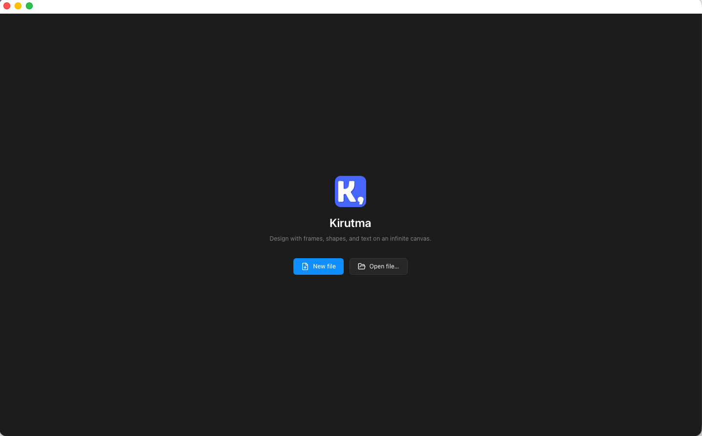
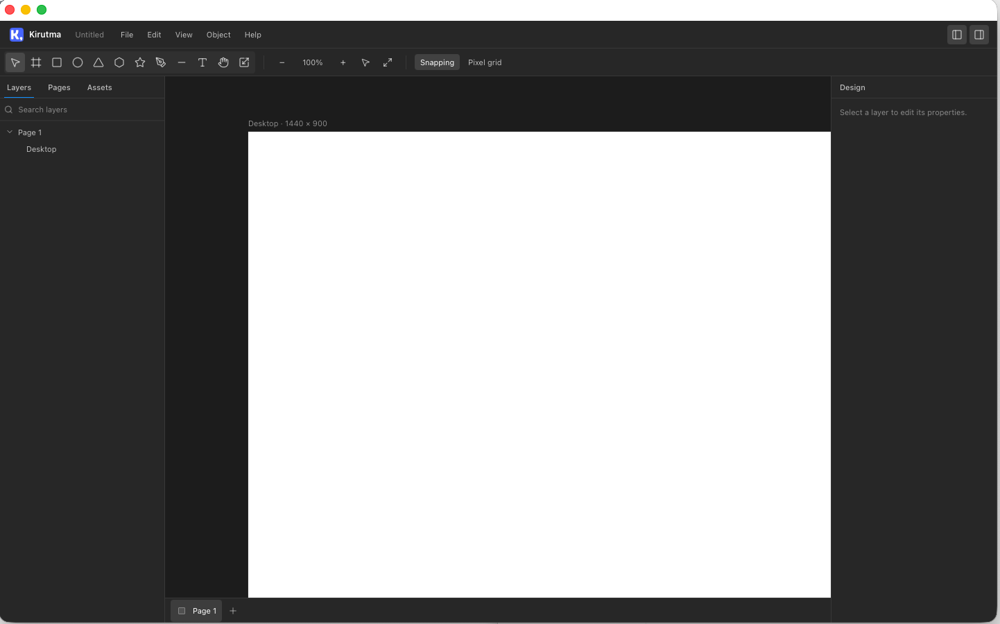
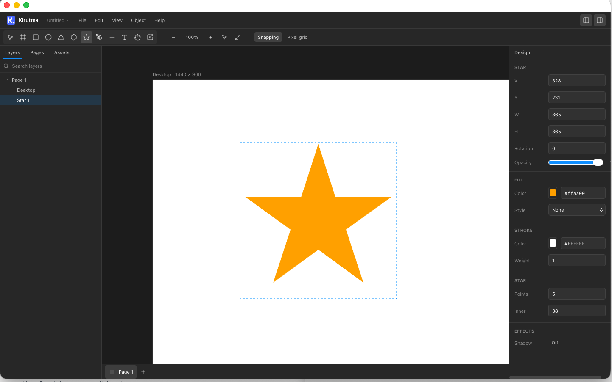
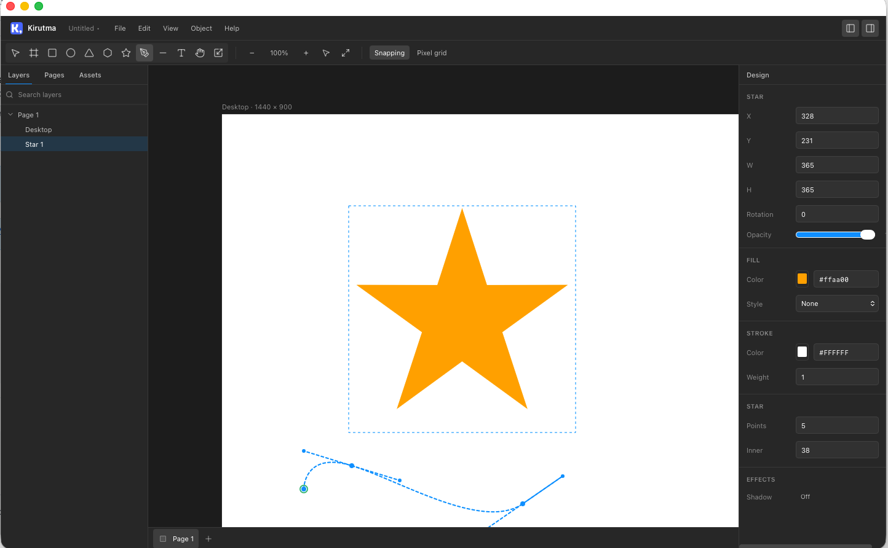
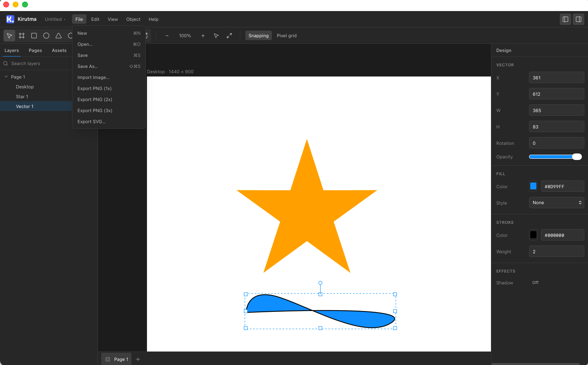

# Kirutma

**Design with frames, shapes, and text on an infinite canvas.**

Kirutma is a desktop design application for UI mockups, layouts, and vector graphics — with layers, styles, components, and PNG/SVG export. Files are saved locally as `.kirutma` documents.

**Owner:** Alexandar Vincent Paulraj

---

## Download

Kirutma is available here: [kirutma.com](https://kirutma.com/)
Contact **[Alexandar Vincent Paulraj](https://github.com/alxv)** for the latest `.dmg` installer.

### Install (Mac)

1. Open the `.dmg` file  
2. Drag **Kirutma** to **Applications**  
3. Launch from Applications  

**First launch:** if macOS shows a security prompt, **right-click Kirutma → Open** (this is normal for apps distributed outside the App Store).

---

## Screenshots

| | |
|---|---|
|  |  |
|  |  |

More images: [`docs/screenshots/`](docs/screenshots/)

---

## Features (v1.0)

- Infinite canvas with pan, zoom, snapping, and pixel grid
- Tools: frames, shapes, pen, lines, text, images
- Layers, pages, color styles, text styles, and components
- Save/open `.kirutma` files · export PNG (1×–3×) and SVG
- Keyboard shortcuts and undo/redo

See **[USER_MANUAL.md](./USER_MANUAL.md)** for the full guide.

---

## License

Copyright © 2026 **Alexandar Vincent Paulraj**. All rights reserved.

Proprietary software — see [LICENSE](./LICENSE).
